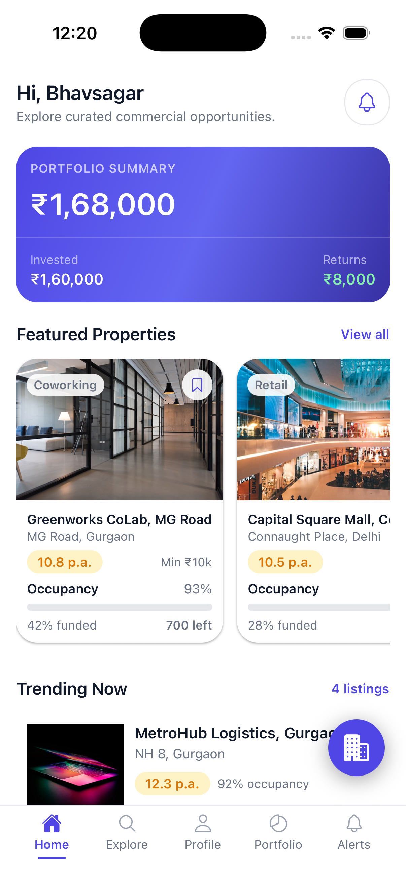
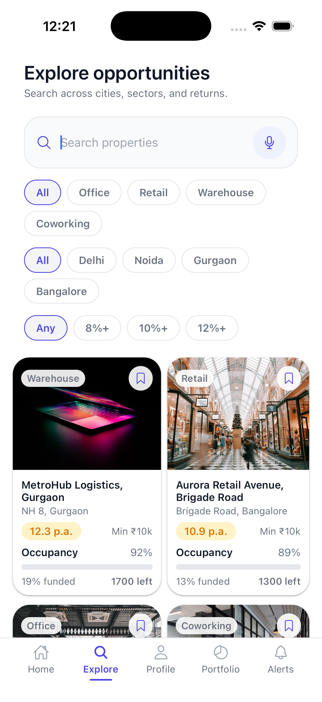
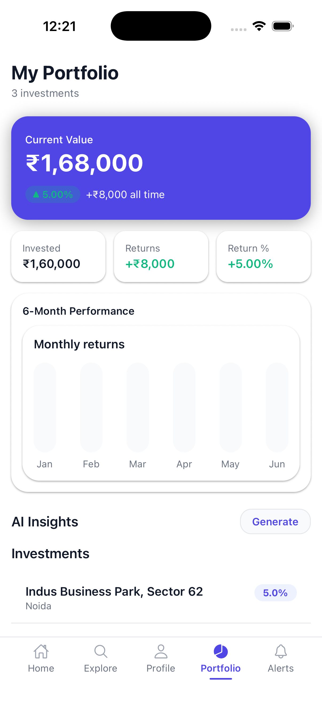
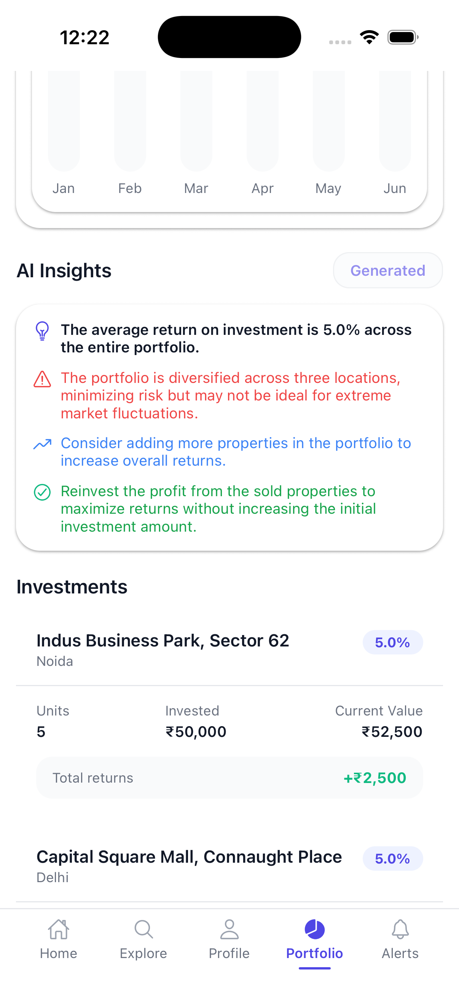
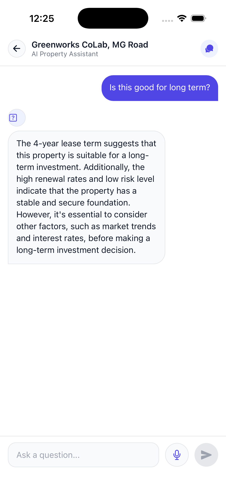
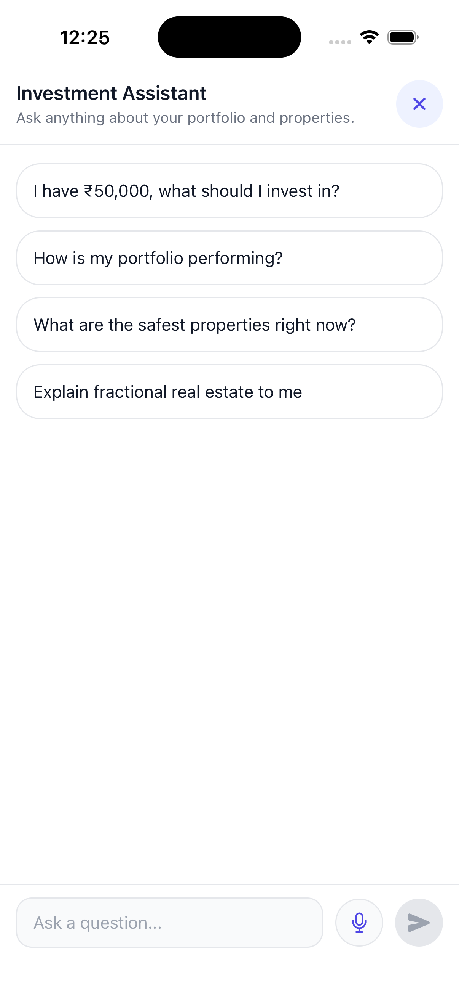

# BrickShare — Fractional Real Estate Investment App

> Own a piece of commercial India from just ₹10,000

BrickShare is a full stack mobile application that lets users invest fractionally in Grade A commercial properties across India — offices, malls, warehouses, and coworking spaces. Built with React Native + Expo on the frontend and Express + Prisma + PostgreSQL on the backend, with AI-powered investment assistance, property Q&A, and portfolio insights.

---

## Screenshots

<div align="center">
  
  
  
  
  
  
</div>

<div align="center">
  
</div>

---

## What It Does

**For investors:**

- Browse Grade A commercial properties across Delhi, Noida, Gurgaon, Bangalore
- Invest from ₹10,000 minimum — fractional ownership
- Track portfolio value, returns, and performance in real time
- Save properties to watchlist, view full transaction history

**AI features:**

- Ask any question about a property — AI answers using real property data
- Get a streaming AI summary of any property — returns, risk, tenants, location
- Investment Assistant — tell it your budget, it recommends properties based on your portfolio
- Portfolio Insights — AI analyses your holdings and suggests diversification
- Voice Search — speak your query, Whisper transcribes it to search filters

---

## Tech Stack

### Frontend

| Technology     | Version | Purpose                       |
| -------------- | ------- | ----------------------------- |
| Expo           | 54.x    | Mobile framework              |
| React Native   | 0.81    | UI layer                      |
| Expo Router    | 6.x     | File-based routing            |
| TypeScript     | 5.x     | Type safety                   |
| NativeWind     | 4.x     | Tailwind CSS for React Native |
| TanStack Query | 5.x     | Server state + caching        |
| Reanimated     | 4.x     | Animations                    |
| Expo Haptics   | —       | Tactile feedback              |
| AsyncStorage   | —       | Token + user persistence      |

### Backend

| Technology        | Version | Purpose                    |
| ----------------- | ------- | -------------------------- |
| Node.js + Express | —       | REST API server            |
| TypeScript        | 5.x     | Type safety                |
| Prisma            | 5.x     | ORM                        |
| PostgreSQL        | 17      | Database (Neon serverless) |
| JWT               | —       | Authentication             |
| bcryptjs          | —       | Password hashing           |

### AI / ML

| Service                     | Purpose                     |
| --------------------------- | --------------------------- |
| Groq — llama-3.1-8b-instant | Chat, streaming responses   |
| Cohere — embed-english-v3.0 | Property embeddings for RAG |
| Groq Whisper                | Voice search transcription  |

---

## Features

### Authentication

- JWT-based auth with 30-day expiry
- bcryptjs password hashing
- Protected routes — token verified on every tab entry
- Persistent session via AsyncStorage
- KYC flow — 3 steps (Personal, Bank, Documents)

### Property Discovery

- Browse 8 commercial properties across 4 cities
- Filter by type (Office, Retail, Warehouse, Coworking)
- Filter by city (Delhi, Noida, Gurgaon, Bangalore)
- Filter by returns (Any, 8%+, 10%+, 12%+)
- Text search across title, location, type, city
- Voice search via Whisper — speak → filters apply
- Bookmark to watchlist with one tap

### Property Detail

- Full image carousel with pagination dots
- Occupancy bar (colour-coded — green/yellow/red)
- Funding progress bar
- Tenant list with icons
- AI Summary — streaming, locks after generation
- Ask AI — property-specific chat

### Investment Flow

- Select units — live return calculation
- Review — platform fee (2%), total amount
- Confirm — Reanimated success animation

### Portfolio

- Live data from backend — real investments
- Current value, invested, returns, return %
- 6-month performance chart
- AI Insights — streaming portfolio analysis
- Individual investment cards

### AI Chat

- Property Q&A — constrained to property context only
- Investment Assistant — knows your full portfolio + all available properties
- Streaming word-by-word responses
- Suggested questions on empty state
- Voice input on every chat screen
- Input guard — blocks prompt injection and off-topic questions
- Rate limiting — 20 messages per 10 minutes per session

---

## Project Structure

```
brickshare/
├── app/                          # Expo Router screens
│   ├── index.tsx                 # Startup routing logic
│   ├── onboarding.tsx            # 3-slide onboarding
│   ├── assistant.tsx             # Investment AI assistant
│   ├── transactions.tsx          # Transaction history
│   ├── watchlist.tsx             # Saved properties
│   ├── auth/
│   │   ├── login.tsx             # Email/password login
│   │   ├── sign-up.tsx           # Registration
│   │   └── kyc.tsx               # KYC verification
│   ├── (app)/                    # Protected tab screens
│   │   ├── _layout.tsx           # Tab navigation + auth guard
│   │   ├── home.tsx              # Dashboard
│   │   ├── explore.tsx           # Browse + filter
│   │   ├── portfolio.tsx         # Investments
│   │   ├── profile.tsx           # User profile
│   │   └── notifications.tsx     # Alerts
│   ├── property/
│   │   ├── [id].tsx              # Property detail
│   │   └── [id]/qa.tsx           # Property AI chat
│   └── investment/
│       └── [id].tsx              # Investment flow
│
├── src/
│   ├── components/
│   │   ├── ui/                   # Button, Input, ChatBubble, etc.
│   │   ├── property/             # PropertyCard, OccupancyBar, etc.
│   │   ├── portfolio/            # InvestmentCard, PortfolioChart
│   │   └── layout/               # ScreenWrapper, TabBar, Header
│   ├── hooks/
│   │   ├── useAssistant.ts       # AI assistant chat logic
│   │   ├── usePropertyQA.ts      # Property Q&A logic
│   │   ├── usePropertySummary.ts # AI property summary
│   │   ├── usePortfolioInsights.ts # AI portfolio analysis
│   │   ├── useVoiceSearch.ts     # Whisper voice input
│   │   └── useBackend.ts         # TanStack Query API hooks
│   ├── lib/
│   │   ├── groq.ts               # Groq client + SSE parser
│   │   ├── cohere.ts             # Cohere embeddings
│   │   ├── whisper.ts            # Whisper transcription
│   │   ├── auth.ts               # Auth state manager
│   │   ├── api.ts                # API fetcher with token injection
│   │   ├── inputGuard.ts         # AI abuse prevention
│   │   └── sessionRateLimit.ts   # Per-session rate limiting
│   └── constants/
│       ├── colors.ts             # Design system colours
│       ├── typography.ts         # Font scale
│       └── spacing.ts            # Spacing scale
│
└── backend/
    ├── src/
    │   ├── routes/
    │   │   ├── auth.ts           # Register + login
    │   │   ├── properties.ts     # Property catalog
    │   │   ├── portfolio.ts      # User investments
    │   │   ├── watchlist.ts      # Saved properties
    │   │   ├── transactions.ts   # Transaction history
    │   │   ├── notifications.ts  # User alerts
    │   │   ├── investments.ts    # Create investments
    │   │   └── chat.ts           # Chat sessions + messages
    │   ├── middleware/
    │   │   ├── auth.ts           # JWT verification
    │   │   └── errorHandler.ts   # Global error handling
    │   └── index.ts              # Express server entry
    └── prisma/
        └── schema.prisma         # Database schema
```

---

## Database Schema

```prisma
User       — id, email, phone, name, password (hashed), kycStatus
Property   — id, title, city, type, expectedReturn, occupancy, images, tenants
Investment — id, userId, propertyId, units, amount, currentValue, returnPercent
Watchlist  — id, userId, propertyId (unique constraint)
Transaction — id, userId, propertyId, type, amount
Session    — id, userId, propertyId, type (property-qa / portfolio-chat)
Message    — id, sessionId, role, content
Chunk      — id, propertyId, text, embedding Float[] (RAG)
```

---

## AI Architecture

### How Streaming Works on Mobile

React Native's `fetch` does not support true streaming. The full SSE response is received, parsed with a custom `parseSSEText()` function, then simulated word-by-word with 3-word chunks at 30ms delay.

```
Groq API → full SSE text → parseSSEText() → word groups → onChunk() → setMessages()
```

### RAG Pipeline (Property Q&A)

```
Property data → system prompt context → Groq → streaming response
```

Full pgvector-based RAG (Cohere embeddings + cosine similarity) is implemented in the codebase and ready for the backend migration phase.

### AI Abuse Prevention

```
User input
  → inputGuard.ts (regex blocks injection + off-topic)
  → sessionRateLimit.ts (20 msgs / 10 mins)
  → system prompt constraint ("only answer BrickShare questions")
  → max_tokens: 250 (hard cap)
  → Groq API
```

---

## API Reference

```
POST   /api/auth/register         Create account
POST   /api/auth/login            Login, get JWT

GET    /api/properties            All properties (public)
GET    /api/properties/:id        Single property (auth)

GET    /api/portfolio             User investments + totals
POST   /api/investments           Create investment
GET    /api/investments           List investments

GET    /api/watchlist             Saved properties
POST   /api/watchlist/:id         Save property
DELETE /api/watchlist/:id         Remove property

GET    /api/transactions          Transaction history
GET    /api/notifications         User notifications

POST   /api/chat                  Save chat message
GET    /api/messages/:sessionId   Get chat history
```

---

## Getting Started

### Prerequisites

- Node.js 20+
- PostgreSQL database (or Neon account)
- Groq API key
- Cohere API key
- Expo Go app or iOS/Android simulator

### Clone

```bash
git clone https://github.com/itsbhavsagar/fintech_app.git
cd fintech_app
```

### Frontend Setup

```bash
npm install
```

Create `.env` in the root:

```env
EXPO_PUBLIC_API_URL=http://localhost:3000
EXPO_PUBLIC_GROQ_API_KEY=your_groq_key
EXPO_PUBLIC_COHERE_API_KEY=your_cohere_key
```

Start the app:

```bash
npx expo start
```

Scan the QR code with Expo Go or press `i` for iOS simulator, `a` for Android.

### Backend Setup

```bash
cd backend
npm install
```

Create `.env` in `backend/`:

```env
DATABASE_URL=your_neon_postgres_url
JWT_SECRET=your_jwt_secret
GROQ_API_KEY=your_groq_key
COHERE_API_KEY=your_cohere_key
PORT=3000
```

Run migrations and seed:

```bash
npx prisma migrate dev
npx prisma db seed
```

Start the backend:

```bash
npm run dev
```

---

## What's Next

- Move AI API calls from client to backend (API keys should never be in mobile app)
- Redis rate limiting — replace in-memory rate limiter
- Full pgvector RAG — property embeddings stored server-side, cosine similarity retrieval
- Razorpay integration — real payment processing
- Push notifications — investment updates, return credits
- Admin panel — property management

---

## Built By

**Bhavsagar** — Frontend / Product Engineer

React · React Native · Next.js · TypeScript · Node.js · AI/LLM Integration

[GitHub](https://github.com/itsbhavsagar) · [LinkedIn](https://linkedin.com/in/bhavsagar92) · [Portfolio](https://bhavsagar.com)

> Also check out [AI LMS Tutor](https://ai-lms-tutor-sigma.vercel.app) — a full stack AI learning platform with RAG pipeline, Groq streaming, and Whisper voice input built from scratch.
